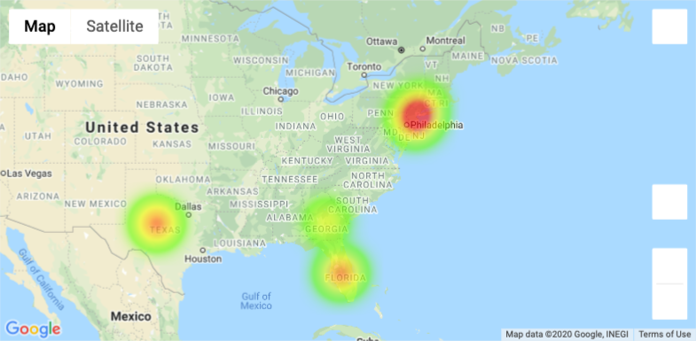
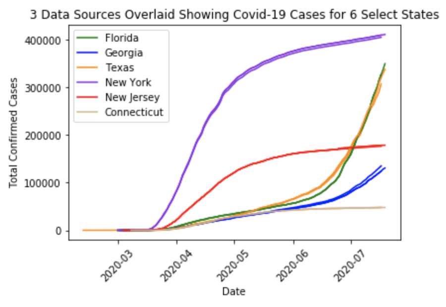
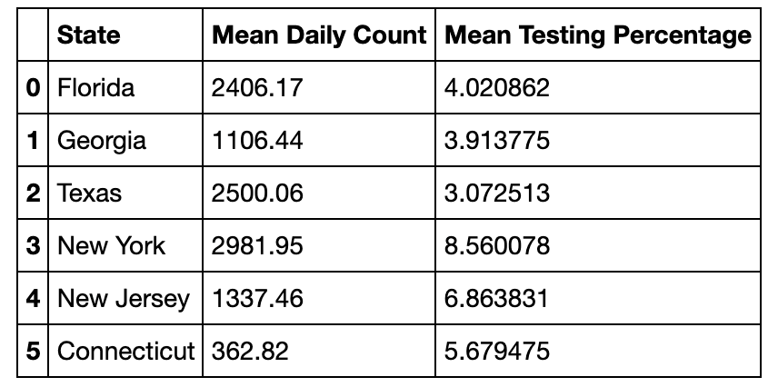
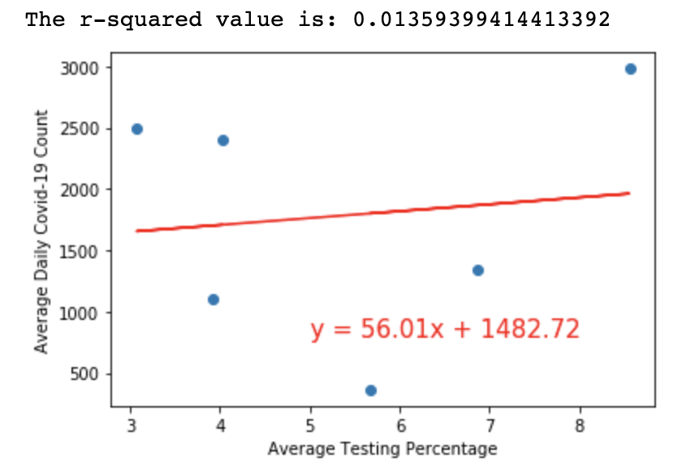
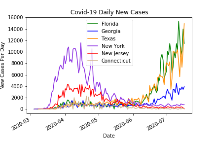
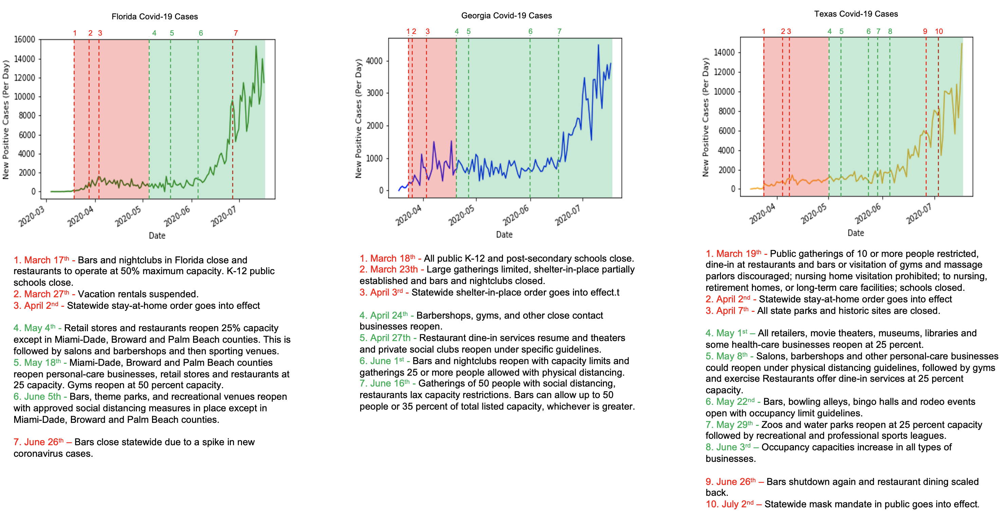
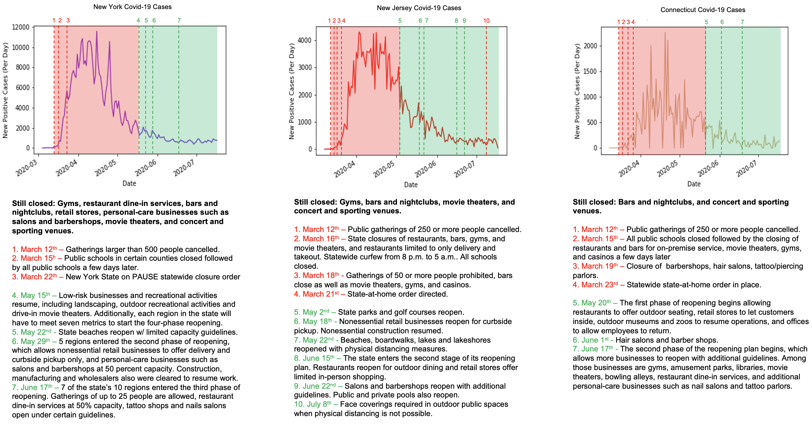
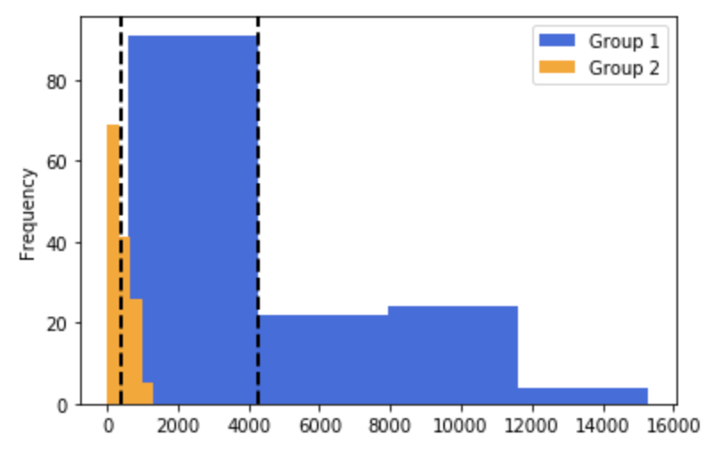
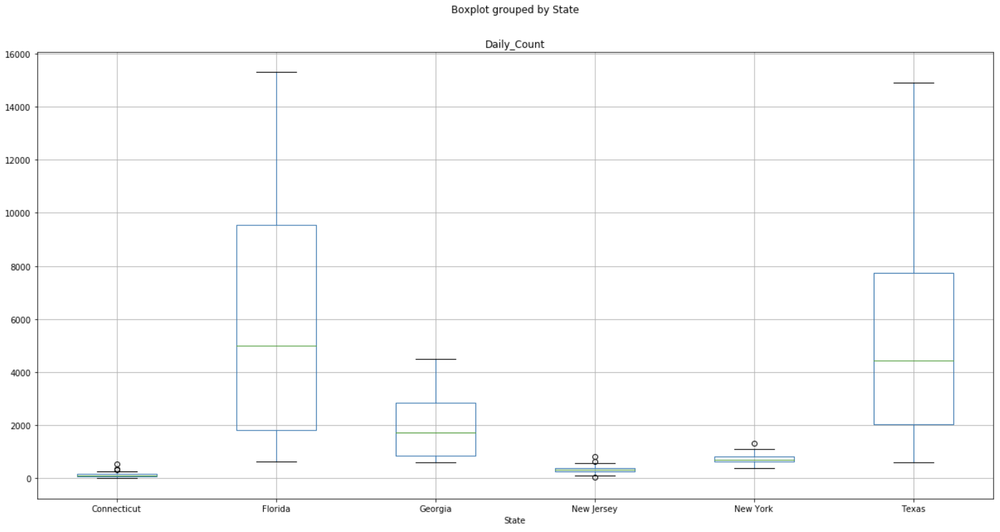

# COVID-19: A Statistical Analysis of Data Accuracy, Impact of Testing, and Effectiveness of State Mandates on Preventing Transmission

   

## Summary ##

This project analyzed three different aspects of COVID-19 in the United States from March 1, 2020 until July 22, 2020. The first was an analysis the accuracy of three distinct COVID-19 data sources (health department, county, and state), in order to see if discrepancies existed in the reporting and/or recording of cases and deaths. Secondly, COVID-19 cases in six states were each compared to their respective population percentages being tested, in order to consider any correlations that may have existed between the two factors. Finally, state and local government mandates in effect during the sequential reopening phases in these same six states were analyzed in order to consider the possible impact they had on transmission prevention. 

The six states that were chosen for this study are Florida, Georgia, Texas, New York, New Jersey, and Connecticut. The first three states mentioned differed significantly from the last three states in their implementation of mandates that restricted the local populations activities. The governors of New York, New Jersey and Connecticut took collective measures to contain COVID-19 within their region of the United States. Consequently, their shutdown dates are within a days of each other. They also approached the progressive reopening of their states with similar degrees of restrictions on businesses and the public. Whereas, in Florida, Georgia and Texas, the governors imposed significantly less mandates on the public and businesses during the phases of reopening. The comparison of these two groups of states allows an examination into the effectiveness of certain mandates on containing COVID-19 spread.
 
State Statistics:
* Florida was ranked second highest in total positive case counts for all US states. Florida's cases started to increase over 1,000 per day on 6/6/20 with the largest single day spike so far occurring on 7/12/20 at 15,135 new cases. The 7-day average was 11,006 new cases per day at the time of this study.  
* Georgia was ranked eigth highest in the US. The largest daily spike occurred on 7/18/20 at 4,689 new cases per day. The 7-day average at the time of this study was 3,495 new cases per day.
* Texas was ranked third highest in the US. Texas started seeing daily cases over 1,000 starting 5/5/20 and the largest single day spike so far occurred on 7/17/20 at 14,916 new cases.  The 7-day average is at the time of this study was 9,893 new cases per day.
* New York was ranked fourth highest in the US. The largest single day spike occurred on 4/10/20 at 8,593 new cases. The 7-day average was 200 new cases per day as of 7/22/20.
* New Jersey was ranked sixth highest in the US. The largest single day spike occurred on 4/3/20 at 4,305 new cases. The 7-day average was 324 new cases per day as of 7/22/20.
* Connecticut was ranked twenty-sixth in total positive case counts. Connecticut's largest daily spike occurred on 4/22/20 at 2,109 new cases and the 7-day average was 84 at the time of this study. 

---

## Process ##

Data was initially extracted from the from the health department, county, and state in the form of CSV files. The CSV files were then loaded into Python as Pandas DataFrames via Jupyter Notebook. Data cleanup was performed to remove null values, filter for the time frame and six states being studied, and format column names and data types to be synonymous for all 3 sources. Statistical analysis was then performed using NumPy and SciPy, and Matplotlib was used to create visualizations.     

---

## Analysis & Conclusions ##
### How did the three data sets compare and did they reveal consistencies or inconsistencies:
* A line plot was produced using each of the three different data sources. The line plots examine date versus total Covid-19 cases in the 6 states. The line plots were compared to see if there were any descrepancies in the data.
* The three data sets selected for this analysis proved to be staistically significantly similar. The histogram showed the data sets overlayed each other indicating the data sets are similar. For further analysis, a t-test was performed. This resulted in t-scores with p-values larger than .05, therefore, the difference found is not statistically significanlty different.

   

### What percentage of the population was tested and how much did testing vary from state to state? Did the testing percentages correlate to COVID-19 count?:
* The percentage of each states population that was tested over time was plotted and then compared. Additionally, a linear regression was performed to see if the average testing percentage of each state correlates to the average daily COVID-19 count.
* The correlation coefficient between testing percentages and COVID-19 count was only 0.12, which indicates there is no relationship between the two variables. This is also demonstrated in the scatter plot where the data points are spread all over rather than being clustered in a linear fashion. The r-squared value of 0.0136 indicates that only 1.36% of the movements of daily COVID-19 count (dependent variable) are explained by the movements in the testing percentage (independent variable). Thus, there is no relationship between the two at all.

  
  

### Did the shutdown and reopening timings of these six states impact the daily new COVID-19 cases? Did the reopening of certain business types cause COVID-19 transmission to skyrocket?:
* The data from source 1 was formatted to show new daily COVID-19 cases rather than total cases. Line graphs of date versus new daily counts were then created. Each line graph was visually compared to see if there were any trends. Trends were considered against state mandates or reopening phases that were being implemented at the time. Each states new daily counts was plotted separately and then examined in relation to the state mandates in effect at the time.
* There appeared to be two different trends in the states data. Florida, Georgia, and Texas have spikes in daily COVID-19 counts from June onwards, whereas New York, New Jersey, and Connecticut have progressively lower daily counts in the same time frame.

  
  
  

#### * Independent T-Test - (statistic = 12.73767146105426, pvalue = 2.9448198049160806e-25)
* Using daily new COVID-19 case counts, the statistical significance of states reopening bars, nightclubs, recreational venues, and having lax restaurant dine-in restrictions was examined against states that did not reopen under such parameters during the same time frame.
* Sample 1 included Florida, Georgia, and Texas. Since these 3 states implemented similar reopening guidelines on June 5th, June 1st, and May 22nd, respectively, new daily COVID-19 cases was considered from June 1st through July 17th.
* Sample 2 includes New York, New Jersey, and Connecticut, all of which that did not have such reopening guidelines.
* The Independent T-Test compared the means of the 2 samples (indepedent populations) for statistically significant differences and found that the means are noticeably different from each other. Group 1 had, on average, 4273 daily new cases of Covid-19 versus the 401 of group 2.
* The T-Test produced a p-value that is significantly smaller than 0.05, which indicates that the differences between the average COVID-19 daily cases in the two state groups is statistically significant. This indicates that the reopening of bars, nightclubs, recreational venues, and lax restaurant dine-in policies significantly contributed to higher transmissions of COVID-19.

    

#### * ANOVA - (statistic = 58.26540963214147, pvalue = 3.0112022192395693e-41)
* In order to cross-examine the accuracy of the Independent T-test, an ANOVA was performed to consider if any of the six states were significantly different statistically from the others.  
* A boxplot was created to help visualize how the states compared in terms of daily new Covid-19 case distribution, the central values, and the variability.
* Florida, Georgia and Texas had much higher daily Covid-19 counts than Connecticut, New Jersey, and New York. The daily COVID-19 highest and lowest values of Florida, Georgia and Texas were both higher than Connecticut, New Jersey, and New York in the corresponding values. These 3 states also had a median COVID-19 count that was higher than the other 3 states, and they also had an immensely larger interquartile range.
* These results suggested that Florida, Georgia, and Texas were consistently experiencing higher Covid-19 counts than Connecticut, New Jersey, and New York. The higher variances in these 3 states also suggested that they experienced much larger fluctuations in the daily Covid-19 counts between June 1st and July 17th.
* A significance level of 0.05 indicates a 5% risk of concluding that a difference exists when there is no actual difference. Since the p-value here is drastically lower than the significance level, the null hypothesis was rejected with no risk and concluded that not all of the 6 states Covid-19 means are equal.

    

---

## Data Sources ##
* https://covidtracking.com/data/download
* https://www.kaggle.com/fireballbyedimyrnmom/us-counties-covid-19-dataset?select=us-counties.csv
* https://raw.githubusercontent.com/nytimes/covid-19-data/master/us-states.csv
* https://www.kaggle.com/headsortails/covid19-us-county-jhu-data-demographics/data?select=us_county.csv
* https://www.washingtonpost.com/graphics/2020/national/states-reopening-coronavirus-map/
* https://www.cdc.gov/covid-data-tracker/#cases

---

## Technologies Used ##
* Jupyter Notebook
* Python - Pandas, Matplotlib, SciPy, NumPy, Datetime
* GMaps API
* CSV file

---

## Authors ##
Kiran Rangaraj - LinkedIn: [@Kiran Rangaraj](https://www.linkedin.com/in/kiranrangaraj/) 
Emily Keymon - LinkedIn: [@Emily Keymon](https://www.linkedin.com/in/ekeymon20/)
Reginald Malden - LinkedIn: [@Reginald Malden](https://www.linkedin.com/in/reginald-malden-5258161b7/)
